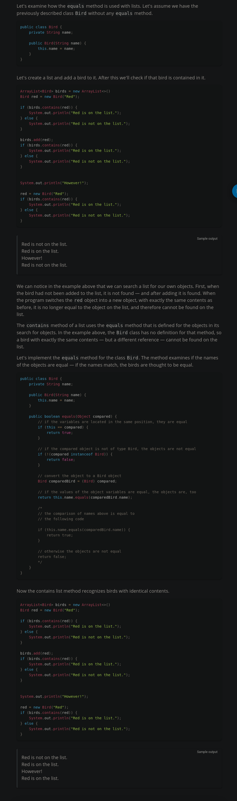

to read input we use:
```java
import java.util.Scanner
Scanner scanner =  new Scanner(System.in);
```
we use the java.util.Scanner library to use Scanner module enables reading input 

```
Scanner scanner = new Scanner(System.in);

String userInput = scanner.nextLine()
```

**Concatenation**
To concatenate strings we use the +(plus) sign
```java
System.out.println("Message" + "Qie");
```

**Variables**
example
```java
String name = "Javac";
System.out.println(name);
```

To declare a variable, start with the type of data being assigned to the Variable, e.g String , followed by the variable name.
```java
String name = "Javac";


System.out.println("Hai wo " + name);
```


**Common Data Types**
- Int: 12 // whole number
- Double : 2.353
- String : "Hello"
- Boolean : true or false


after setting the data type for a variable this cannot be changed. This is called Variable Types Persist.
E.g
```java
int number = 10;
// the above cannot be changed to
number = false; // this is wrong and the compilation will fail
```
Excpetions for Data Type Change
E.g 
```java
double number = 10.012;
int value = 9;
number = value;
System.out.println(number); // 9.0
```

**Type Conversion**
1. Converting string to integer
```java
Scanner scanner = new Scanner(System.in);
int value = Integer.valueOf(scanner.nextLine());

```

2. Converting string to Double
```java
Scanner scanner = new Scanner(System.in);
double value = Double.valueOf(scanner.nextLine());
```

3. Converting string to Boolean
When converting a string to Boolean in which boolean values are: true or false , any other string than : True/true (it's not case sensitive) will be ingored. 
```java
Scanner scanner = new Scanner(System.in);
Boolean value = Boolean.valueOf(scanner.nextLine());
```


## Arithmetic Operations

**Key Rules in Java:**
- Multiplication (*), Division (/), and Modulo (%) have equal precedence and are evaluated left to right. 
- Addition (+) and Subtraction (-) have equal precedence and are also evaluated left to right.
- Parentheses () have the highest precedence and should be used to clarify intent.
```java


import java.util.Scanner;

public class MultiplicationFormula {

    public static void main(String[] args) {
        Scanner scanner = new Scanner(System.in);

        // Write your program here
        /*
            Give the first number:
            2
            Give the second number:
            8
            2 * 8 = 16
        */

        System.out.println("Give the first number:");
        int first = scanner.nextInt();

        System.out.println("Give the second number:");
        int second = scanner.nextInt();

        int result = first * second;

        System.out.println(first + " * " + second + " = " +  result);
    }
}

```

**Division**
In division the data type of variables given in the operation will affect the value returned in the operation. 
```java
int first = 3;
int second = 20;

int divisionResult = first / second;
// result in integer

int secondDivisionResut = (double) first / second;
//result in decimal
```

**Typecasting** 
```java
int first = 3;
int second = 20;

int divisionResult = (double) first / second;
// result in decimal 
```


**Comparison Operators**
| Operator | Description | 
| --- | --- |
| >	| greater than |
| >= 	| greater than or equal to |
| < 	| less than |
| <= 	| less than or equal to |
| == 	| equal to |
| != 	| not equal to |


The result of a condition is aa booelan vlaue and from the below  the boolean value from the comparison is stored in a boolean varialble.


```java
int first = 1;
int second = 3;
boolean isGreater = first > second;

```

**Module Operator**
The module operator returns the  remainder of a value. Take for example if we have:
```java
Scanner scanner = new Scanner(System.in);

int userInput = scanner.nextLine();
bool evaluate = userInput % 400 == 0 
System.out.println("Evaluation value: " + evaluate);
```


When comparing strings we use the equals-command, which is related to string variables.
```java
String userInput = scanner.nextLine();
if (userInput.equals("toSomeString")){
    System.out.println("Do these");
} else {
    System.out.println("Do these");
}
```


## Continue and break 
The ``break`` statement is used to exit a loop. 
The ``continue`` statement takes the execution of the program .


Example: 
```java
import java.util.Scanner

public class NumberOfNegatives() {

    public class static void main(string[] args) {
        // declare scanner variable
        Scanner scanner = new Scanner(System.in);

        // count number of negative values
        int negativeCount = 0;
        int userInput = 0;
        while (true) {
            // get userInput
            System.out.println("Give a number:");
            userInput = Integer.valueOf(scanner.nextLine());

            // check if zero exit
            if (userInput == 0) {
                break;
            }
            // check if number is negative
            if (userInput < 0) {
                negativeCount = negativeCount + 1;
            }
        }
        System.out.println("Number of negative numbers: " + negativeCount);
    }
}
```

## For loop
The for loop structure:
```
for (*introducing a variable*; *condition*; *increasing the counter*) {
    // Functionality to be executed
}
```


```java
for (int i = 0; i < userInput; i++) {  /// i++ is executed after the for block code is executed
    System.out.println("I is " + i);
}
```


## OOP Programming
When you are writing a program, whether it's an exercise or a personal project, figure out the types of parts the program needs to function and proceed by implementing them one part at a time. Make sure to test the program right after implementing each part.

Never try solving the whole problem at once, because that makes running and testing the program in the middle of the problem-solving process difficult. Start with something easy that you know you can do. When one part works, you can move on to the next.


## Functions / Methods
structure of function name;
```
public static void main() {
    // functional block
}
```
- public : visibility modifier for the function
- static :
- void : return type for the function
- main : name of the function

```java
public static void main() {
    // functional block
    greet();
}

public static void greet(){ 
    System.out.println("Hello World");
}
```

**Parameters**
Methods/Functions can take variables/arguments which can then be used withinn the functionm
```java
public static void Greeting(int userGreeting) {
    for (int i = 0; i < userGreeting; i++ )
    {
        // do sth
    }
}
```

**Passing multiple arguments to a function:**
```java
public static void sum (int firstNumber, int secondNumber) {
    int result = firstNumber + secondNumber;
    System.out.println(result);
}

sum(2, 5);
```

One can also pass an expression to a function arguments. The expression is evaluated prior to the method call
```java
public static void sum (int firstNumber, int secondNumber) {
    int result = firstNumber + secondNumber;
    System.out.println(result);
}
sum(2+2, 5);
```

method parameters are distinct from the variables (or parameters) of other methods, even if they had the same name. As a variable is passed to a method during a method call, the value of that variable gets copied to be used as the value of the parameter variable declared in the method definition. Variables in two separate methods are independent of one another.


**return values for a function**
A method can have a return value. To add a return value one must specify the type of the value in the definition of the method.
```java
public static int sum(int a , int b){
    int sumOfParameters = a + b;
    return sumOfParameters;
}
```


# Part 3

## Discovering errors
- always go through your code.
- set comments.
- add debugging statements to check execution of your code.
- when naming methods, set names that provide a description of their functionality.


## Lists

**Objectives**
- You are familiar with the list structure and know how to use a list in a program.
- You are familiar with the concept of an index, you can add values to a list, and you know how to retrieve information from a list's indices.
- You know how to iterate over a list with multiple different loop types.
- You know how to check if a value exists in a list, and also know how to remove values from a list.
- You are aware of the list being a reference-type variable, and become familiar with using lists as method parameters.


ArrayList : this is a premade tool in java that is used in creating List. it also provides various methods for array operations such as adding , removin and selecting items from a list.


Syntax:
```java
ArrayList<String> listName = new ArrayList<>();
```
the variable must be of type: ``ArrayList`` which is then followed by the type of the values stored in the list.   
To declare the new array we use: ``new ArrayList<>();``
When setting the type for the values in the ArrayList they must be capitalized.  
E.g
```java
ArrayList<String>
ArrayList<Integer>
ArrayList<Double>
ArrayList<Boolean>
```

Why?
There are 2 types of variables:
- primitive variables
In primitive varialbles hold the actual value  

- reference  variables
Reference variables know a reference point which knows where the actual values are stored. 

The reason for this has to do with how the ArrayList is implemented. Variables in Java can be divided into two categories: value type (primitive) and reference type (reference type) variables. Value-type variables such as int or double hold their actual values. Reference-type variables such as ArrayList, in contrast, contain a reference to the location that contains the value(s) relating to that variable.

Value-type variables can hold a very limited amount of information, whereas references can store a near limitless amount of it.


```java
import java.util.ArrayList;

class ArrayIntroduction {
    public static void main(String[] args) {
        // create new arraay varialble
        ArrayList<String> planets = new ArrayList<>();


        planets.add("Jupiter");
        plaents.add("Mars");
        planets.add("Earth");

        System.out.println(planets);

    }
}
```

To call a list method we: syntax: nameOfListVariable followed by dot and the list method. ``listVar.method()``

List Methods:
- add
add some value to the list

- get
retrieve using indexing


```java

System.out.println(planets.get(0));

```

**for each loop**
When you are not required to keep track of the index for the values in a list you can use the ``for each`` loop.
Syntax:
```
for (TypeOfVariable nameOfVariable: nameOfList)
```
where TypeOfVariable is the list's element type, and nameOfVariable is the variable that is used to store each value in the list as we go through it.

```java
ArrayList<Integer> numbers = new ArrayList()<>;


numbers.add(1)
numbers.add(2)
numbers.add(3)
numbers.add(4)
numbers.add(5)

for (int value : numbers) {
    System.out.println("number" + value);
}
```


**Remove Method**
The list remove() method is used to remove a value from an array using either the index or the value itself. 
however the method differs depending on the type of the array

- Integer array
To remove a value from an integer array we use: 
* index
```java
numberList.remove(0); // remove at index 0
```


* Value
To use the value we : 
convert the int to Integer
```java
numberList.remove(Integer.valueOf(15)); // in this case the numberList has a value of 15
```


- String array
in a stringg array you could either give the value or the index
```java
planetsArray.remove(0);

planetsArray.remove("Earth");
```


**contain method**
The list contain method is used to check if a value exist. It returns a boolean value : true if value exist and false if not
```
myList.contain("someVaue");
```


**List as an argument/parameter value to a method**
A list can be passed as an argument to a method in the following. 
- Define the type to be of list type
- Define the type of the values
- Define the name of the argument:

Example:
```java
public static void printItemsInList(ArrayList<String> userList) {
    for(String item: userList) {
        System.out.println(item);
    }
}
```


At anytime you provide a list as a parameter value to a method, any operation/modification performed on the list does affect the original value. 
As list is reference type variable(it knows the reference point to the values in the list). 

*When a list (or any reference-type variable) is copied for a method's use, the method receives the value of the list variable, i.e., a reference. In such a case the method receives a reference to the real value of a reference-type variable, and the method is able to modify the value of the original reference type variable, such as a list. In practice, the list that the method receives as a parameter is the same list that is used in the program that calls the method.*


## Arrays
arrays are known as the ancestors of ArrayList: ``ArrayList<Integer> myList = new ArrayList<>();``  

To use an array use the following syntax:
```java
int[] myNewArray = new int[5]
```

The above myNewArray has 5 values which can be accessed using indexing as follows:  
```java
myNewArray[0];
```

To add values into the array: 
* Using the index to assign a value


```java
myNewArray[0] = 20;
myNewArray[3] = 2;
```

One can also use a loop to iterate values within the array:  

```java
int i = 0;
while (i < myNewArray.length) {
    System.out.println(myNewArray[i]);
    i++;
}
```


You can create an array stating the type of the elements of the array followed by square brackets (typeofelements[]).
``String[] myPlanets = new String[5];`` 

Array is an object, so when you change the array inside the method, the changes persist after the execution of the method.


**Initializing an array with a block**
When you initialize an array with a block, the length of the array is precisely the number of the values specified in the block. The values of the block are assigned to the array in the order, eg. the first value is assigned to index 0, the second value to index 1 etc.
```java
String[] planets = {"Earth", "Uranus", "Saturn"};

int a = 0; 
while (a < planets.length) {
    System.out.println("Planet" + planets[a]);
    a++;
}
```


## Using strings
Learning Objectives
- Revising reading, printing and comparing Strings
- Knowing how to split a string into several pieces


**Reading Input**  
```java
import java.util.Scanner;

class StringIntroduction {
    public static void main(String[] args) {
        Scanner scanner  = new Scanner(System.in);
        String userInput = scanner.nextLine();
    }
}
```

**Outputing Strings**
```java
System.out.println("User is set to study");
```

**Equals() method for string comparisons**

```java
String myString = "hello world";
if (myString.equals("hello")){
    System.out.println("Not equals to string: hello");
} else if (myString.contains("hello")) {
    System.out.println("text contains string: hello");
} else {
    System.out.println("Did not found any string match!!");
}
```
When comparing strings, you should make sure the string variable has some value assigned to it. If it doesn't have a value, the program will produce a NullPointerException error

You can split a string to multiple pieces with the split-method of the String class. The method takes as a parameter a string denoting the place around which the string should be split. The split method returns an array of the resulting sub-parts. In the example below, the string has been split around a space.


**Getting characters using charAt() method**
get a character at a specified index of a string with the charAt method.

```java
String myText = "hello world";
myText.charAt(myText.charAt(0));
```

**Length() string method**

Returns the length of the string
```java
String myText = "hello world";
myText.length();
```


# Part 4

## Introduction to object-oriented programming


**Learning Objectives**  
- You're familiar with the concepts of class, object, constructor, object methods, and object variables.
- You understand that a class defines an object's methods and that the values of instance (object) variables are object-specific.
- You know how to create classes and objects, and know how to use objects in your programs.


**Introduction**
To define a class we use the following syntax:
```
modifier class nameOfClass {
    // define the class/instance variables
    // define the class methods
}
```

The modifier can either be:
- public
- private
- protected

Followed by the ``class keyword`` and lastly open & closed curly braces ``{}``

```java
public class Person {
    private String name; //  declare name property/variable for the class
    private int age; // declare age property/variable for the class
}
```


Defining a Constructor

We want to set an initial state for an object that's created. Custom objects are created the same way as objects from pre-made Java classes, such as ArrayList, using the new keyword. It'd be convenient to pass values ​​to the variables of that object as it's being created. For example, when creating a new person object, it's useful to be able to provide it with a name:
```java
public static void main(String[] args) {
    Person ada = new Person("Ada");
    // ...
}
```

This is achieved by defining the method that creates the object, i.e., its constructor. The constructor is defined after the instance variables. In the following example, a constructor is defined for the Person class, which can be used to create a new Person object. The constructor sets the age of the object being created to 0, and the string passed to the constructor as a parameter as its name:
```java
public class Person {
    private String name;
    private int age;

    public Person(String initialName) {
        this.age = 0;
        this.name = initialName;
    }
}
```
The constructor's name is always the same as the class name. The class in the example above is named Person, so the constructor will also have to be named Person. The constructor is also provided, as a parameter, the name of the person object to be created. The parameter is enclosed in parentheses and follows the constructor's name. The parentheses that contain optional parameters are followed by curly brackets. In between these brackets is the source code that the program executes when the constructor is called (e.g., new Person ("Ada")).

Objects are always created using a constructor.

A few things to note: the constructor contains the expression this.age = 0. This expression sets the instance variable age of the newly created object (i.e., "this" object's age) to 0. The second expression this.name = initialName likewise assigns the string passed as a parameter to the instance variable name of the object created.


**Default Constructor**  
If the programmer does not define a constructor for a class, Java automatically creates a default one for it. A default constructor is a constructor that doesn't do anything apart from creating the object. The object's variables remain uninitialized (generally, the value of any object references will be null, meaning that they do not point to anything, and the values of primitives will be 0)

For example, an object can be created from the class below by making the call new Person()
```java
public class Person {
    private String name;
    private int age;
}
```


If a constructor has been defined for a class, no default constructor exists. For the class below, calling ``new Person() // with no arguments`` would cause an error, as Java cannot find a constructor in the class that has no parameters.
```java
public class Person {
    private String name;
    private int age;

    public Person(String initialName) {
        this.age = 0;
        this.name = initialName;
    }
}
```


**Class Methods**  
A method is written inside of the class beneath the constructor. The method name is preceded by public void, since the method is intended to be visible to the outside world (public), and it does not return a value (void).
```java
public class Person {
    private String name;
    private int age;

    public Person(String initialName) {
        this.age = 0;
        this.name = initialName;
    }

    public void printPerson() {
        System.out.println(this.name + ", age " + this.age + " years");
    }
}
```

**Objects and the Static Modifier**  
We've used the modifier static in some of the methods that we've written. The static modifier indicates that the method in question does not belong to an object and thus cannot be used to access any variables that belong to objects.

Going forward, our methods will not include the static keyword if they're used to process information about objects created from a given class. If a method receives as parameters all the variables whose values ​​it uses, it can have a static modifier.


To access a class variables within  a  method we use the keyword: ``this``

e.g
```java
public void PrintPerson() {
    System.out.println("Name: " + this.name + "\n" + "Age: " + this.age);
}
```

**Class Method with return values**
```java 
public int returnAge()  {
    return this.age;
}

Person james = new Person("James");
System.out.println("The age  of james " + james.returnedAge());
```


**A string representation of an object and the toString-method**  
The string representation of an object can be defined by a method which returns a "string representation" of the object. The method returning the string representation is always set to: ``toString``.

example: 
```java
public String toString() {
    return "Name of person " + this.name + " and age is " + this.age;  
}

Person person = new Person("James" , 123)
System.out.println(person);
```

The call to the toString method returning the string representation does not have to be written explicitly, as Java adds it automatically. When a programmer writes:
```java
System.out.println(antti);

// Java extends the call at run time to the following form:

System.out.println(antti.toString());
```


## Handling Objects in a List
In previous sections you have learned how to add items/values to a list. E.g a String variable is also an object. We can use a list to store objects as shown:
```java
class Person {
    private String name; 
    private int age;

    public Person(String userName) {
        this.name = userName;
        this.age = 0;
    }

    public String toString() {
        return "Username:  "  + this.userName + "\n" + "Age: " + this.age;
    }
}
```


```java
import java.util.ArrayList;

class MainProgram  {
    public void main(String args[]){
        ArrayList<Person> persons = new ArrayList<>();
        Person john = new Person("John");
        persons.add(john);

        Person matt = new Person("Matt");
        persons.add(matt);

        for (Person personItem : persons) {
            System.out.println(personItem); 
        }

    }
}
```


## Files and Reading Data

**Learning Objectives**  
- You'll review reading keyboard input.
- You know what a file and a filesystem are, and are able to add an empty text file into the filesystem.
- You know how to create a write a program that reads data from a file.


To read a file in java we pass the file path using the ``Path.get()`` to the Scanner constructor. After which it reads the file line by line, therefore we use a ``while() `` loop  until it reaches the end of the line.   
By default the file is read from the root directory of the project folder that contains src directory and other files such as pox.ml file.  
When using Scanner to read the file we  use the try {} catch {} block in which if we have no errors the try block is executed fully and if an error occurs the catch block is executed.

Example:
```

import java.nio.file.Paths;
import java.util.Scanner; 

class ReadFileExample() {
    public void main(String[] args){
        try (Scanner scanner = new Scanner(Paths.get("files.txt"))) {
            while (scanner.hasNextLine()) {
                String  row = scanner.nextLine(); // reads the current line
                System.out.println(row);
            }   
        } catch(Exception e) {
            System.out.println("Error" + e.getMessage())
        }
    }
}
```

- hasNextLine() : check whether the file has a new line
- nextLine() : reads the current line and then moves to the end of the given line . 

Code | Description | 
| --- | --- |
| hasNextLine() → true	| Pointer still at start of file.
| nextLine() → "Hello"	| Reads first line, pointer moves to after "Hello" (before "World").
| hasNextLine() → true	| Checks again – there is "World".
| nextLine() → "World"	| Reads second line, pointer moves to end of file.
| hasNextLine() → false	| No more lines.


Sometimes when you read a file a line within it maybe empty, for further processing or incases you may not want to work with this empty line you can do the following:   
```java
while (true) {
    String row = fileRead.er.nextLine();
    if (row.isEmpty()) { /// 
        break;
    } else {
        // do sth with the data
    }
}

```
# Part 5

## Learning object-oriented programming

**Constructor Overloading**

The technique of having two (or more) constructors in a class is known as constructor overloading. A class can have multiple constructors that must differ in the number and/or type of their parameters. It's not, however, possible to have two constructors with the exact same parameters.


Example:
```java
class Person {
    private String weight;
    private int age;
    private String name;

    public Person(String userName) {
        this.name = userName;
        this.age = 0;
        this.weight = 0;
    }


    public Person(String userName, String userAge) {
        this.name = userName;
        this.age = userAge;
        this.weight = 0;
    }
}
```
From the above we have 2 constructors when creating objects you could either one argument or 2 arguments. 


However in the above we have repitition. To avoid this we could call the second constructor using ``this`` keyword as shown below:
```java
public Person(String userName) {
    this(userName, 0)
}
```
the above calls the second constructor while passing the userName variable to the second constructor together with the value 0 which is used as the userAge.


**method overloading**
In method overloading we could have same methods but with different parameters/arguments.(ensure this)

```java
Class Person {
    private int age;
    private String name;


    public Person(String userName, int userAge) {
        this.age = userAge;
        this.name = userName;
    }

    public growOlder() {
        this.growOlder(1);
    }

    public growOlder(int age) {
        this.age += age;
    }

    public growYearOlder() {
        this.age += 1;
    }
} 
```


## Primitive & Reference Variables


**Objectives**  
- You understand the terms primitive and reference variable.
- You know the types of primitive variables in Java, and also that there can be practically an infinite number of different reference variables.
- You know the differences in behavior between primitive and reference variables when values are assigned to them, or when they're used as method parameters.


Primitive variables: store their values directly
Reference variables: have a pointer which points to an object which contains the values

**Type of Primite variables:**  
- Boolean: true of false
- short int  : -32768 to 32767
- float : a floating point number that uses 32 bits.
- int : 32 bit value that represents a medium sized integer: 2^-31 to 2 ^31 - 1
- long int : 64 bit value that represents a larger integer: 2 ^ 63 to 2 ^ 63 -1
- Bytes: 1 byte = 8 bits  between values -128 to 127
- char : 16 bits representing a single character
- double: flaoting point number that uses 64 bits


Whenever we pass a variable to  a methods which requires an argument, what actually happens is that the value of the variable is given to the method parameter, any modification occur on the copied value and not the original value. 

Other than the mentioned above primitive variables, the rest are reference variables. A programmer can create his/her own variables using Objects(Reference variable)

When it comes to Objects/Reference variables when you pass the value as a method arguments, the method receives a pointer to an object. So any changes to the fields/data of the object are reflected to the original/passed argument. 

**Example on Reference variables**
```java
public class Person {
    private String name;
    private int birthYear;

    public Person(String name) {
        this.name = name;
        this.birthYear = 1970;
    }

    public int getBirthYear() {
        return this.birthYear;
    }

    public void setBirthYear(int birthYear) {
        this.birthYear = birthYear;
    }

    public String toString() {
        return this.name + " (" + this.birthYear + ")";
    }
}
```
We'll inspect the execution of the program step by step.

```java
public class Example {
    public static void main(String[] args) {
        Person first = new Person("First");

        System.out.println(first);
        youthen(first);
        System.out.println(first);

        Person second = first;
        youthen(second);

        System.out.println(first);
    }

    public static void youthen(Person person) {
        person.setBirthYear(person.getBirthYear() + 1);
    }
}

Sample output

First (1970)
First (1971)
First (1972)
```


## Objects and references


**Learning Objectives**
- You will brush up on using classes and objects.
- You know what a null reference is, and what causes the NullPointerException error.
- You can use an object as an object variable and a method parameter.
- You can create a method that returns an object.
- You can create the method equals, which can be used to check if two objects of the same - have the same contents or state.


Calling a constructor with the command ``new`` causes several things to happen. First, space is reserved in the computer memory for storing object variables. Then default or initial values are set to object variables (e.g. an int type variable receives an initial value of 0). Lastly, the source code in the constructor is executed.
A constructor call returns a reference to an object. A reference is information about the location of object data.


**null value of a reference variable**  
null means nothing and in this case, it's possible to assign the kewyord null to any refernce value. When an object reference is not being used it is cleaned by the garbage collector in java.
```java
Person ball = joan;
ball = null;

ball.growOlder(); // this will result in an NullException error
```

**Object equality and lists**




in the above image we have : 
1. Bird method with no custom equals method
In this scenario changing the reference value with ``red = new Bird("red");`` creates a new reference address which when compared in the last part with ``if (birds.contain(red)) {}`` red points to a new reference address compared to the previous one added to birds 
2. Bird method with custom equals method that checks : 
    - this ==  compared
    -  compared instanceof ClassName
    -  this.property == / equals() comparedItem.property whereby comparedItem is typecast of the compared object

in this since we are comparing all of the above the last part: ``if (birds.contain(red) {})`` this condition will return true as both the name property of the 2 instances are the same.


**Object as a method's return value**  
A method can also return an object of any type. 
In this case we will be using the ``clone()`` method which returns the current instance/object and assigns it to a new variable as a new Object. The state of the values at which the clone method is called for the clone object will be the same.

*In this example we present a simple counter that has the method clone. The method can be used to create a clone of the counter; i.e. a new counter object that has the same value at the time of its creation as the counter that is being cloned.*

```java
public class Counter{
    private int counter;

    // constructor
    public Counter() {
        this(0); // we call this()) with the argument 0 to call the constructor which takes a single argument : this(0,0) : this takes 2 arguements meaning total of 3 constructors
    }

    public Counter(0) {
        this.counter  = 0;
    }

    public void increase()  {
        this.counter++;
    }

    public void decrease() {
        this.counter--;
    }

    public Counter clone() {
        Counter newCloned = new Counter(this.value);
        return newCloned;
    }
}

```

**Final**
The word final used in the definition of object variables. The values of these object variables cannot be modified after they have been set in the constructor. 